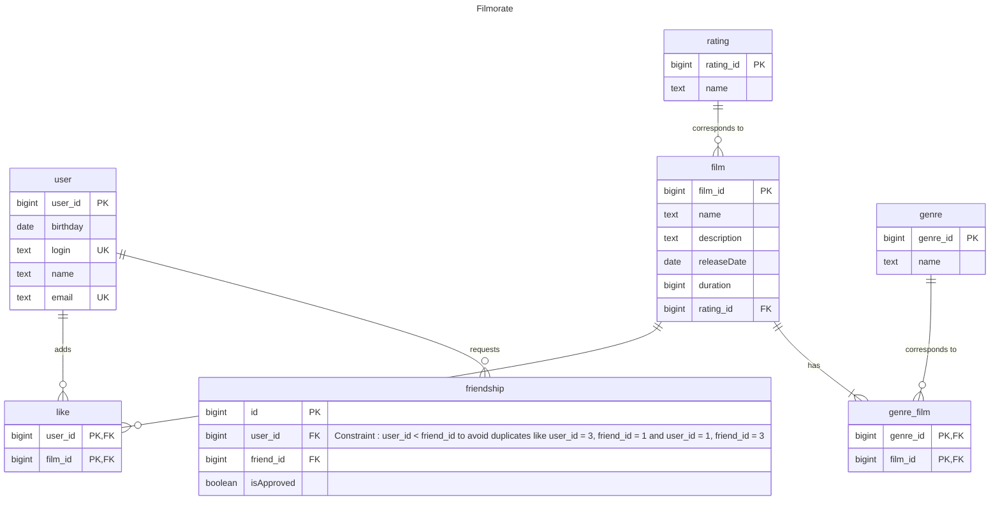

# java-filmorate
repository for Filmorate project.

[Краткое описание задачи](#title1)

[Список файлов](#title3)

[ER диаграмма БД приложения](#title4)

[Пояснения к ER-диаграмме](#title5)

[Примеры SQL запросов](#title6)

[Автор](#title2)

### <a id="title1">Краткое описание задачи</a>
Бэкенд для сервиса, который будет
1) работать с фильмами и оценками пользователей, а также возвращать топ-10 фильмов,   
   рекомендованных к просмотру.
2) отображать список друзей, добавлять пользователей в друзья, удалять из друзей, выводить список общих друзей

### <a id="title3">Список файлов</a>

| Пакет               | Пакет      | Файл                          | Описание                                     |
|---------------------|------------|-------------------------------|----------------------------------------------|
| main.java.filmorate |                                              |     | Контроллеры                                  |
|                     | controller |                               |                                              |
|                     |            | ExceptionHandler              |                                              |
|                     |            | FilmController                |                                              |
|                     |            | UserController                |                                              |
|                     | service    |                               | Сервисы, для операций с хранилищами данных   |
|                     |            | FilmService                   |                                              |
|                     |            | UserService                   |                                              |
|                     | exception  |                               | Исключения                                   |
|                     |            | DuplicatedDataException       |                                              |
|                     |            | IllegalAccessToModelException |                                              |
|                     |            | NotFoundException             |                                              |
|                     | storage    |                               | Хранение данных, операции с объектами данных |
|                     |            | FilmStorage                   |                                              |
|                     |            | InMemoryFilmStorage           |                                              |
|                     |            | InMemoryUserStorage           |                                              |
|                     |            | Storage                       |                                              |
|                     |            | UserStorage                   |                                              |
|                     | model      |                               | Модели данных                                |
|                     |            | Create                        |                                              |
|                     |            | ErrorResponse                 |                                              |
|                     |            | Film                          |                                              |
|                     |            | ReleaseDateConstraint         |                                              |
|                     |            | ReleaseDateValidator          |                                              |
|                     |            | StorageData                   |                                              |
|                     |            | Update                        |                                              |
|                     |            | User                          |                                              |
|                     |            | FilmorateApplication          |                                              |
| main.resources      |            |                               | Настройки и пр ресурсы                       |
|                     |            | application.properties        |                                              |
| test.java.filmorate |            |                               | Тесты                                        |
|                     |            | ExpectedViolation             |                                              |
|                     |            | FilmTest                      |                                              |
|                     |            | UserTest                      |                                              |
|                     |            | storage                       |                                              |
|                     |            | InMemoryUserStorageTest       |                                              |
| README.md                    |            |                               | описание проекта                             |


### <a id="title4">ER диаграмма БД приложения</a>


### <a id="title5">Пояснения к ER-диаграмме</a>
- Таблица *film* содержит информацию о фильмах
- Таблицы *user* содержит информацию о пользователях
- Таблица *genre* содержит список доступных жанров
  - Таблица *rating* содержит список доступных рейтингов. У фильма может быть 1 ретинг, поэтому связь 1 ко многим
- Таблица *genre_film* содержит информацию о жанрах фильмов, является ассоциативной, так как как у 1 фильма может быть 
несколько жанров
- Таблица *friendship* содержит информацию о статусе дружбы между пользователями. 
У каждого пользователя может быть больше 
 одного друга, статус isApproved отображает одобрена ли дружба между пользователями. Для избежания дубликатов в таблице 
(например, user_id=1, friend_id=4 и user_id=4, friend_id=1) в таблице добавлено ограничение на добавление записей 
"user_id < friend_id"
- Таблица *like* содержит список лайков фильмов. У таблицы составной ключ (user_id, film_id)

### <a id="title6">Примеры SQL запросов</a>
получение всех фильмов:

```sql
SELECT * FROM film
```

получение всех пользователей:

```sql

SELECT * FROM user
```

получение топ N наиболее популярных фильмов:

```sql

SELECT * 
FROM film WHERE film_id IN
(SELECT film_id 
FROM likes GROUP BY film_id ORDER BY COUNT(film_id) DESC LIMIT 10)
```

получение списка общих друзей с другим пользователем:
```sql

SELECT * 
FROM user WHERE user_id IN (
-- Подзапросом находим и объединяем с UNION все id друзей(user_id) пользователей 1 и 4 с одобренным статусом дружбы.
SELECT user_id 
FROM (SELECT user_id 
      FROM friendship 
      WHERE friend_id in (1,4) AND isApproved=true
      UNION ALL 
      SELECT friend_id AS user_id 
      FROM friendship 
      WHERE user_id in (1,4) AND isApproved=true) AS found_friends
-- В объединенной таблице c user_id находим те id, которые встречаются больше 1 раза, то есть общие и у 1 и 4 друга. 
GROUP BY id 
HAVING COUNT(id)>1)


```

### <a id="title2">Автор</a>
Юлия А.