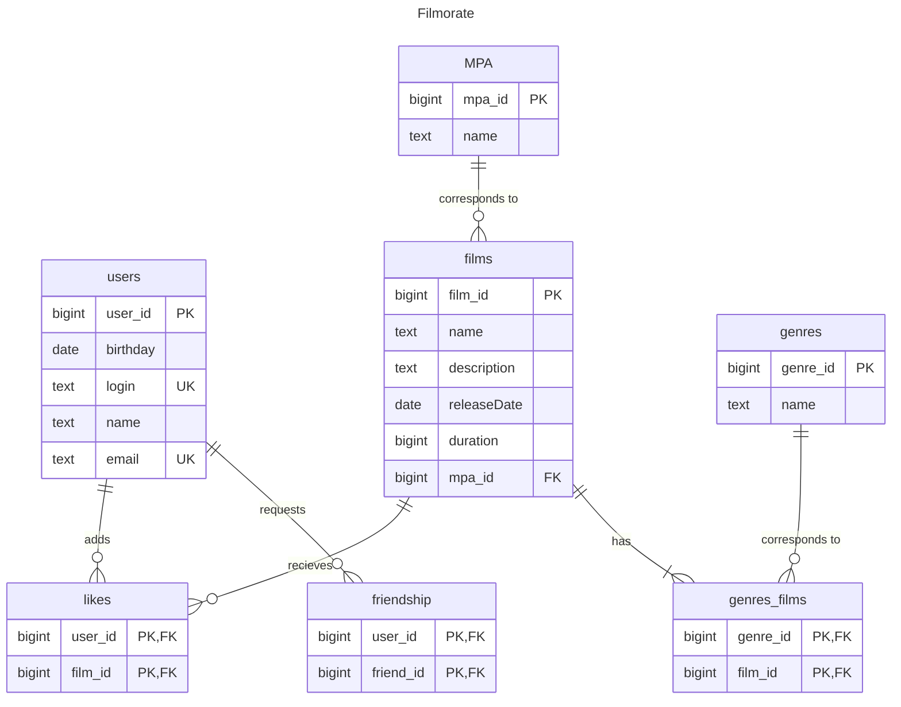

# java-filmorate
repository for Filmorate project.

[Краткое описание задачи](#title1)


[ER диаграмма БД приложения](#title4)

[Пояснения к ER-диаграмме](#title5)

[Примеры SQL запросов](#title6)

[Автор](#title2)

### <a id="title1">Краткое описание задачи</a>
Бэкенд для сервиса, который будет
1) работать с фильмами и оценками пользователей, а также возвращать топ-10 фильмов,   
   рекомендованных к просмотру.
2) отображать список друзей, добавлять пользователей в друзья, удалять из друзей, выводить список общих друзей

### <a id="title4">ER диаграмма БД приложения</a>


### <a id="title5">Пояснения к ER-диаграмме</a>
- Таблица *films* содержит информацию о фильмах
- Таблицы *users* содержит информацию о пользователях
- Таблица *genres* содержит список доступных жанров
   - Таблица *MPA* содержит список доступных рейтингов. У фильма может быть 1 ретинг, поэтому связь 1 ко многим
- Таблица *genres_films* содержит информацию о жанрах фильмов, является ассоциативной, так как как у 1 фильма может быть
  несколько жанров
- Таблица *friendship* содержит информацию о статусе дружбы между пользователями.
  У каждого пользователя может быть больше
  одного друга. У таблицы составной ключ (user_id, friend_id)
- Таблица *likes* содержит список лайков фильмов. У таблицы составной ключ (user_id, film_id)

### <a id="title6">Примеры SQL запросов</a>
получение всех фильмов:

```sql
SELECT * FROM films
```

получение всех пользователей:

```sql

SELECT * FROM users
```

получение топ N наиболее популярных фильмов:

```sql

SELECT * 
FROM films WHERE film_id IN
(SELECT film_id 
FROM likes GROUP BY film_id ORDER BY COUNT(film_id) DESC LIMIT 10)
```

получение списка общих друзей с другим пользователем:
```sql
SELECT friend_id FROM friendship WHERE user_id IN (1,4) GROUP BY friend_id 
HAVING COUNT(friend_id)>1)
```

### <a id="title2">Автор</a>
Юлия А.